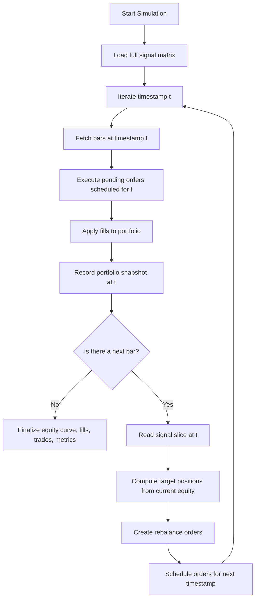
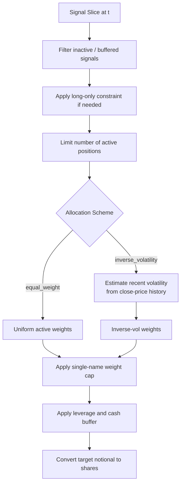
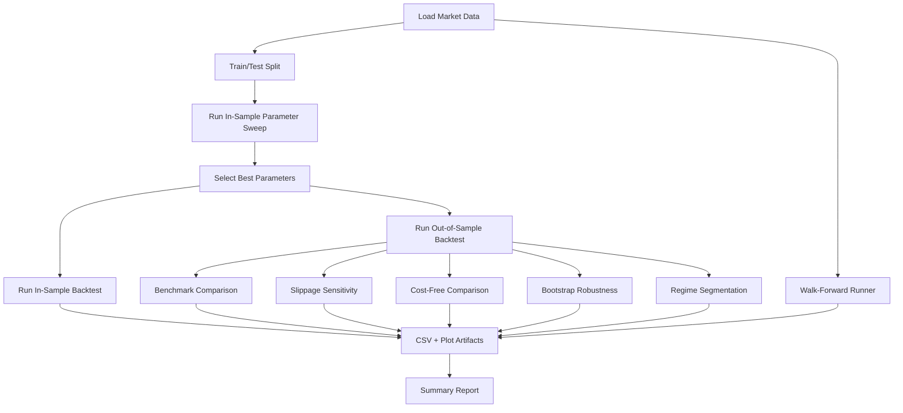

# QuantBT

QuantBT is an event-driven backtesting framework for systematic trading research in Python. The codebase is structured around a clear separation between market data ingestion, signal generation, execution simulation, portfolio accounting, performance analytics, and report generation.

The project is intended for research workflows where execution timing, transaction costs, portfolio constraints, and out-of-sample validation materially affect conclusions. It supports multi-asset OHLCV data, delayed execution, parameter sweeps, walk-forward validation, bootstrap robustness analysis, and regime-level performance diagnostics.

## Repository Structure

```text
.
├── README.md
├── main.py
├── pyproject.toml
├── requirements.txt
├── data/
├── reports/
├── src/
│   └── quantbt/
│       ├── analysis/
│       │   ├── regimes.py
│       │   ├── reporting.py
│       │   └── robustness.py
│       ├── backtester/
│       │   ├── engine.py
│       │   ├── sweep.py
│       │   └── walk_forward.py
│       ├── data/
│       │   ├── loader.py
│       │   └── synthetic.py
│       ├── execution/
│       │   └── simulator.py
│       ├── metrics/
│       │   └── performance.py
│       ├── portfolio/
│       │   └── state.py
│       ├── strategies/
│       │   ├── base.py
│       │   ├── breakout.py
│       │   ├── mean_reversion.py
│       │   └── moving_average.py
│       ├── config.py
│       ├── types.py
│       └── utils.py
└── tests/
```

## What The Framework Covers

- Multi-asset OHLCV data loading and validation
- Strategy interfaces with reusable signal-generation modules
- Event-style execution with next-bar fills
- Transaction cost, spread, and slippage modeling
- Volume-based partial fill constraints
- Portfolio construction with leverage, cash buffer, and position caps
- Portfolio accounting for cash, exposures, equity, and trade logs
- Performance metrics and benchmark comparison
- In-sample parameter sweep and out-of-sample evaluation
- Walk-forward optimization
- Moving-block bootstrap robustness analysis
- Regime segmentation
- Automated report writing and plot generation
- Unit tests for core engine invariants

## System Overview

At a high level, the framework operates on a canonical market data object, generates signals from a strategy, converts those signals into target positions, schedules orders for a future bar, simulates fills with costs and liquidity constraints, updates portfolio state, and records portfolio and trade history for later analysis.

```mermaid
flowchart LR
    A["Raw OHLCV Data<br/>(CSV or Yahoo Finance)"] --> B["Canonical MarketData<br/>timestamp x asset MultiIndex"]
    B --> C["Strategy.generate_signals()"]
    C --> D["BacktestEngine"]
    D --> E["PositionSizer<br/>target shares"]
    E --> F["Order Queue<br/>pending next-bar orders"]
    F --> G["ExecutionSimulator<br/>fills, costs, slippage"]
    G --> H["PortfolioState<br/>cash, positions, trades"]
    H --> I["Equity Curve + Trade Log"]
    I --> J["Metrics / Reports / Plots"]
```



## Runtime Event Flow

The engine is event-style rather than vectorized-only. Signals may be computed in batch, but orders are executed through an explicit bar-by-bar loop that preserves causal ordering.



## Core Runtime Objects

### `MarketData`

`MarketData` is the central data container used by the framework. Internally, bars are stored in a `pandas.DataFrame` indexed by:

- `timestamp`
- `asset`

Required columns:

- `open`
- `high`
- `low`
- `close`
- `volume`

The container provides helpers to:

- retrieve one asset as a time series
- slice data by date range
- resample bars
- preserve a canonical representation across loaders and strategies

### `SignalEvent` / `Order` / `Fill`

The framework defines typed domain objects in `types.py` for conceptual clarity:

- `SignalEvent`
  intended representation of strategy output
- `Order`
  scheduled desired position change
- `Fill`
  simulated executed quantity and execution costs

Although the engine operates mainly on DataFrames plus `Order` and `Fill` objects, these types keep the lifecycle explicit and easier to extend.

### `PortfolioState`

`PortfolioState` maintains:

- cash
- current positions
- average entry prices
- realized PnL
- unrealized PnL
- trade log
- fill log
- equity snapshots

This state is updated only through fills and end-of-bar snapshots, which makes the accounting path easier to audit.

## Strategy Layer

Strategies live under `src/quantbt/strategies/` and inherit from `BaseStrategy`.

Each strategy implements:

```python
generate_signals(market_data: MarketData) -> pd.DataFrame
```

The returned signal frame is indexed by `timestamp` and `asset` and contains a `signal` column. Signal values are directional and are later mapped to target positions by the sizing layer.

### Included Strategies

#### Moving Average Crossover

Trend-following strategy using fast and slow moving averages.

- long signal when `fast_ma > slow_ma`
- short signal when `fast_ma < slow_ma`
- optional long-only mode

#### Mean Reversion

Rolling z-score strategy with stateful entry and exit rules.

- enter long when z-score is sufficiently negative
- enter short when z-score is sufficiently positive
- flatten when the deviation contracts back toward zero

#### Momentum Breakout

Breakout strategy using lagged highs and lows.

- uses `shift(1)` before rolling breakout calculation
- avoids using the current bar in its own trigger level
- supports flat exits with shorter trailing breakout windows

## Execution Model

Execution is modeled explicitly and is intentionally decoupled from signal generation.

### Timing Convention

Signals are read on bar `t`, but resulting orders are scheduled for the next available bar. Fill price is based on either:

- `next_open`
- `next_close`

This is the primary mechanism used to prevent same-bar future leakage.

### Fill Calculation

For each pending order:

1. Select raw execution price from the configured bar field.
2. Compute volume-limited maximum fill quantity.
3. Compute filled quantity and residual quantity.
4. Estimate slippage as:
   base slippage + volume-share impact
5. Add half-spread cost.
6. Adjust execution price by side:
   buy fills move up, sell fills move down
7. Compute notional, commission, slippage cost, and spread cost.

### Liquidity Handling

If the desired quantity exceeds the configured `volume_limit`, only a partial fill is executed on that bar. Any residual quantity is carried forward as a pending order for the next timestamp.

### Cost Model

The execution model supports:

- basis-point commission
- optional fixed commission
- spread cost via half-spread basis points
- flat slippage basis points
- volume-share slippage basis points

These costs are on by default in the research workflow.

## Portfolio Construction

Signals do not directly become fills. They first pass through the `PositionSizer`, which converts directional signals into target share counts.

Supported controls include:

- long-only or long/short mode
- maximum gross leverage
- minimum cash buffer
- per-asset weight cap
- maximum active positions
- equal-weight allocation
- inverse-volatility allocation

### Position Sizing Flow



## Portfolio Accounting

The accounting path is built around two objects:

- `PositionState`
- `PortfolioState`

### `PositionState`

Tracks per-asset:

- quantity
- average price
- realized PnL
- entry timestamp
- entry bar index

When a fill arrives, the position object determines whether the fill:

- opens a new position
- adds to an existing position
- partially closes a position
- fully closes a position
- flips the direction of the position

Closed trades are emitted when inventory is reduced against an existing position.

### `PortfolioState`

Tracks global portfolio state:

- cash
- all `PositionState` objects
- fill log
- trade log
- end-of-bar equity records

At each snapshot, it computes:

- market value
- realized PnL
- unrealized PnL
- equity
- return
- turnover
- gross exposure
- net exposure

## Metrics

The metrics module computes a standard set of portfolio and trade statistics:

- cumulative return
- annualized return
- annualized volatility
- Sharpe ratio
- Sortino ratio
- maximum drawdown
- Calmar ratio
- win rate
- profit factor
- average trade return
- turnover
- average gross exposure
- number of trades

Benchmark metrics are computed separately using an equal-weight buy-and-hold portfolio over available assets.

## Research Workflow

The CLI orchestrates a repeatable research process rather than a single backtest run.



### In-Sample / Out-of-Sample Split

The default research process splits timestamps into:

- in-sample segment
- out-of-sample segment

Parameter selection happens on the in-sample segment only. The selected parameter set is then evaluated on the out-of-sample segment.

### Parameter Sweep

For each parameter combination:

- instantiate the strategy
- run a full backtest on the in-sample set
- rank combinations by a target metric, typically Sharpe ratio

### Walk-Forward Optimization

The walk-forward runner repeatedly:

1. selects a training window
2. runs a parameter sweep on that window
3. chooses the best parameter set
4. evaluates the next test window
5. stitches the test-window returns into a combined out-of-sample curve

This is useful for checking whether the chosen parameters remain stable across time.

### Bootstrap Robustness

The bootstrap routine uses a moving-block bootstrap over returns rather than iid resampling. This preserves some short-horizon serial dependence and produces:

- terminal equity distributions
- Sharpe ratio distributions
- percentile summaries
- probability of positive return
- probability of Sharpe above threshold

### Regime Segmentation

The regime analysis module infers market states from an equal-weight aggregate market series built from the available assets.

It labels periods by:

- trend state:
  bull or bear
- volatility state:
  high volatility or low volatility

Strategy and benchmark performance are then recomputed inside each regime bucket.

## Bias Control and Modeling Assumptions

### Look-Ahead Bias Control

The framework attempts to control future leakage through:

- next-bar execution
- lagged breakout thresholds
- strategy computations based only on data available up to the signal bar
- walk-forward parameter selection on prior windows only

### Survivorship Bias

The engine itself does not impose a survivorship-biased universe. If the dataset contains delisted or inactive names, they can be processed as long as bars are present. Any survivorship bias introduced by present-day symbol selection comes from the input universe, not from the simulation logic.

### Overfitting Controls

The codebase includes:

- train/test separation
- parameter sweep reporting
- cost-aware vs cost-free comparison
- walk-forward validation
- bootstrap robustness analysis
- regime-level performance diagnostics

## Installation

Use a local virtual environment.

```bash
python3 -m venv .venv
source .venv/bin/activate
python -m pip install --upgrade pip
python -m pip install -e .[dev]
```

## Usage

### Generate Sample Data

```bash
python main.py generate-sample-data --output-dir data --periods 504 --assets SPY,QQQ,IWM
```

### Run Using Local CSV Data

```bash
python main.py run --data-dir data --output-dir reports
```

### Run Using Yahoo Finance

```bash
python main.py run --tickers SPY,QQQ,IWM --start 2018-01-01 --end 2024-12-31 --output-dir reports
```

### Example Research Run

```bash
python main.py run \
  --data-dir data \
  --strategies moving_average,mean_reversion,breakout \
  --price-source next_open \
  --commission-bps 5 \
  --slippage-bps 3 \
  --spread-bps 2 \
  --allocation-scheme inverse_volatility \
  --max-asset-weight 0.25 \
  --max-active-positions 5 \
  --min-cash-buffer 0.03 \
  --bootstrap-iterations 500 \
  --walk-forward-train-bars 126 \
  --walk-forward-test-bars 63 \
  --walk-forward-step-bars 63 \
  --regime-lookback 63 \
  --output-dir reports
```

## Common CLI Options

- `--strategies`
  comma-separated strategy list
- `--price-source`
  `next_open` or `next_close`
- `--allow-short`
  enable long/short positioning
- `--allocation-scheme`
  `equal_weight` or `inverse_volatility`
- `--max-asset-weight`
  cap target concentration in a single asset
- `--max-active-positions`
  cap simultaneous holdings
- `--min-cash-buffer`
  reserve capital instead of fully deploying the book
- `--bootstrap-iterations`
  number of bootstrap resamples
- `--walk-forward-train-bars`
  walk-forward training window length
- `--walk-forward-test-bars`
  walk-forward test window length
- `--walk-forward-step-bars`
  step size between walk-forward windows
- `--regime-lookback`
  lookback horizon for regime inference

## Output Artifacts

For each strategy, the framework writes a report bundle under `reports/<strategy>/`.

Typical files:

- `in_sample/metrics.csv`
- `in_sample/parameter_sweep.csv`
- `out_of_sample/metrics.csv`
- `out_of_sample/benchmark_metrics.csv`
- `out_of_sample/robustness.csv`
- `out_of_sample/walk_forward_segments.csv`
- `out_of_sample/walk_forward_metrics.csv`
- `out_of_sample/bootstrap_stats.csv`
- `out_of_sample/regime_summary.csv`
- `out_of_sample/regime_assignments.csv`
- `summary.txt`

Typical plots:

- equity curve
- drawdown curve
- rolling Sharpe / volatility
- monthly return heatmap
- parameter sweep visualization
- walk-forward equity curve
- bootstrap distribution plots
- regime performance plot

## Testing

Run:

```bash
pytest
```

Current tests cover:

- signal generation behavior
- no-look-ahead properties
- transaction cost and slippage calculations
- execution timing
- position and PnL accounting
- metric calculations
- walk-forward utilities
- allocation constraints
- regime segmentation logic

## Extension Points

### Adding a Strategy

1. Add a new strategy class under `src/quantbt/strategies/`.
2. Inherit from `BaseStrategy`.
3. Implement `generate_signals(self, market_data)`.
4. Optionally provide a parameter grid for sweep-based research.
5. Register the strategy in `main.py`.

### Adding a Data Source

1. Load raw bars into a DataFrame with `timestamp`, `open`, `high`, `low`, `close`, and `volume`.
2. Convert the result into the canonical `MarketData` representation.
3. Reuse the existing engine, execution, metrics, and reporting layers.

### Adding New Analytics

The analysis layer is intentionally separate from the execution engine. New diagnostics can usually be added without touching the bar-by-bar simulation loop, as long as they operate on one or more of:

- equity curve
- fills
- trades
- benchmark curve
- signal matrix

## Current Limitations

- Execution is bar-based rather than intrabar.
- Market impact is simplified to spread plus basis-point slippage and participation scaling.
- Benchmark construction is equal-weight buy-and-hold rather than factor-aware or risk-model-aware.
- Corporate actions, point-in-time universes, and delisting handling depend on the input dataset.
- The current event loop is single-process and oriented toward research clarity rather than large-scale distributed simulation.

## Roadmap

- correlation-aware portfolio construction
- regime-aware strategy activation rules
- sector or factor exposure constraints
- intraday datasets and execution assumptions
- multi-frequency workflows
- live paper-trading adapters
